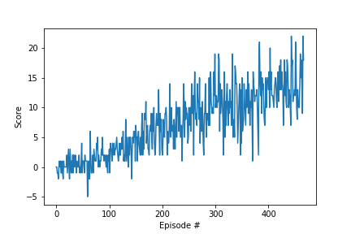

# Report

In this project, the Unity Banana Navigation environment was solved using deep reinforcement learning algorithms **DQN** and **Double DQN**.

## Algorithm

### NN Architecture

1. Fully-connected layer - input: 37, output: 128
2. Fully-connected layer - input: 128, output: 64
3. Fully-connected layer - input: 64, output: 4

### Parameters

For training

- Maximum steps per episode: 1000
- Starting epsilion: 1.0
- Ending epsilion: 0.01
- Epsilion decay rate: 0.999

DQN params

- Replay buffer size: 1e5
- Batch Size: 64
- Gamma (discount factor): 0.99
- Tau (or soft update of target parameters): 1e-3
- Learning Rate: 5e-4
- Update Frequency (how often to update the network): 4    

## Results

### Vanilla DQN

Environment solved in 408 episodes. See below output and plot.

```
Episode 100	Average Score: 1.31
Episode 200	Average Score: 5.04
Episode 300	Average Score: 8.31
Episode 400	Average Score: 10.32
Episode 500	Average Score: 12.70
Episode 508	Average Score: 13.03
Environment solved in 408 episodes!	Average Score: 13.03
```


### Double DQN

Environment solved in 364 episodes. See below output and plot.

```
Episode 100	Average Score: 0.67
Episode 200	Average Score: 4.40
Episode 300	Average Score: 8.45
Episode 400	Average Score: 10.88
Episode 464	Average Score: 13.01
Environment solved in 364 episodes!	Average Score: 13.01
```



## Future Work
- Hyper-parameter optimization
- Dueling DQN
- Prioritized Experiene Replay
- Rainbow DQN
